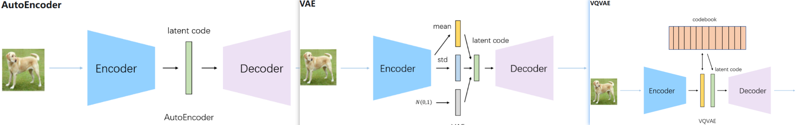
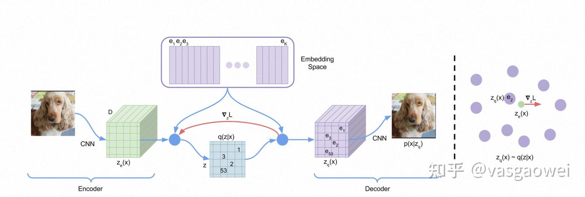
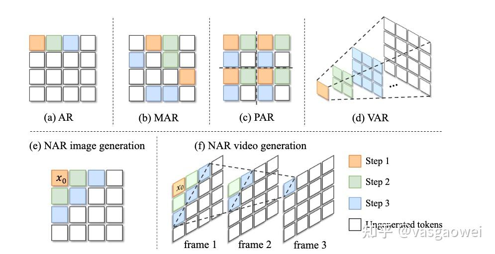
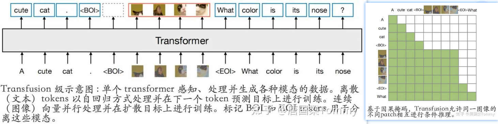
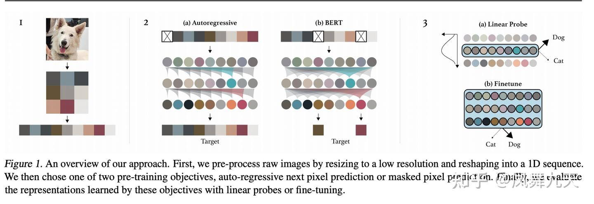
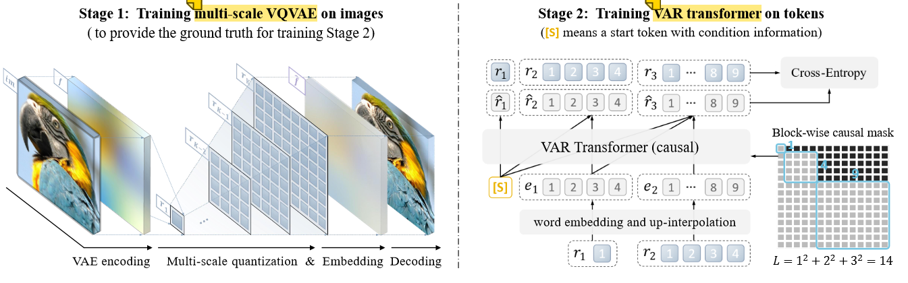
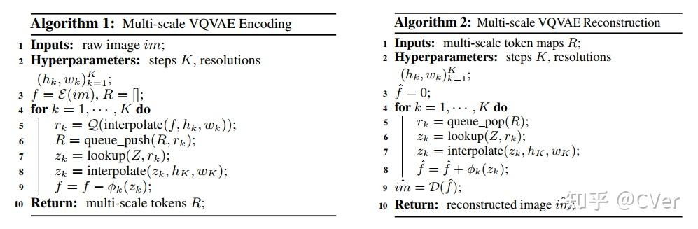
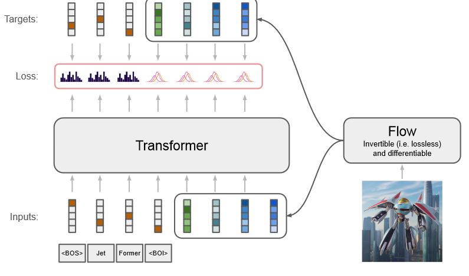

自回归模型（AR）：通过对序列中先前的输入进行测量来自动预测序列中的下一个分量，是一种用于时间序列分析的统计技术，它假设时间序列的当前值是其过去值的函数。自回归模型使用类似的数学技术来确定序列中元素之间的概率相关性。然后，它们使用所得知识来猜测未知序列中的下一个元素。
视觉自回归模型（VAR）：

自回归图像生成技术探索路线：VQ-GAN、ImageGPT、CogView、JetFormer:

>[ChatGPT-4o 更新生图能力：原生多模态的图文生图技术详解：自回归路线的逆袭 ](https://www.cnblogs.com/LexLuc/p/18798718)
>
>Decoder-Only Transformer 模型？

## 1. AR自回归图像生成：AE（Visual Tokenizers）

阅读博文：

- [自回归图像生成中的Visual Tokenizers: AEs](https://zhuanlan.zhihu.com/p/22553430415)
- [AutoEncoder与自回归图像生成](https://zhuanlan.zhihu.com/p/681895334)

AE与AR图像生成的关系：第一阶段训练 “AEs”，第二阶段对AR自回归图像token预测模型进行训练（如[PixelCNN](https://zhida.zhihu.com/search?content_id=239662218&content_type=Article&match_order=1&q=PixelCNN&zhida_source=entity)、Transformer）；

经典AE技术：

- **AE**：图片经过编码器得到 latent code， 解码得到重建图片；缺：对噪声敏感

- **VAE（变分自编码）**：通过编码器学习出mean和std编码，随机采样一个**正态分布**的编码α，通过 α*std+mean 重采样得到latent code【确保梯度可传播】，解码器进行重建；优：对输入噪声不敏感，预先知道每个属性都是服从正态分布，对于任意采样都能重构出鲁棒的图片；

- **VQ-VAE（vector quantized variational autoencoder）**：通过编码器学习出中间编码，然后通过最邻近搜索将中间编码映射为[codebook](https://zhida.zhihu.com/search?content_id=174419408&content_type=Article&match_order=1&q=codebook&zhida_source=entity)中K个向量之一【**离散量化+查表**】，通过解码器对latent code进行重建。生成模式是“自回归的 **pixcl-CNN **+codebook”， 交叉熵损失？

  

  

  

- VQ-VAE 2：多层次的VQ-VAE：层次化的向量量化

- VQ-GAN：引入Transformer?

- **MaskGIT(MAE)**：

- **DALL·E tokenizer 【D-VAE】**:[D-VAE](https://sunlin-ai.github.io/2022/06/02/DALL-E.html)：生成模式是”自回归的 **GPT**+codebook“

  

## 2. AR自回归图像生成：分类

阅读博文：

- [文生图中从扩散模型到流匹配的演变：从SDXL到Stable Diffusion3(含Flow Matching和Rectified Flow的详解)](https://blog.csdn.net/v_JULY_v/article/details/136318383?login=from_csdn)、

- [AI绘画原理解析：从CLIP、BLIP到DALLE、DALLE 2、DALLE 3、Stable Diffusion](https://blog.csdn.net/v_JULY_v/article/details/131205615)

#### 2.1 按照预测序列顺序进行的分类：

自回归图像生成需要设定一种比较合理的*序列生成顺序*，以及定义合适的序列里面的每一个“元素”，据此，可以将AR技术分类：

- next-pixel-prediction: 【raster-order、random-order】，AR、MAR，raster-order：GPT系列+单向Transformer，random-order：BERT系列+双向Transformer
- next-patch-prediction: 【raster-order】，PAR
- Next-Block-Prediction

- next-set-token-prediction: 【raster-order、random-order、曼哈顿距离order】， 如Muse、MaskGit、NAR、ZipAR

- Next-Scale-Prediction:  VAR [北大 字节]
- Next-Frequency-Prediction: FAR

> raster-order光栅顺序：从左到右、从上到下，从左上角到右下角；

#### 2.2 按照 image token的离散、连续进行分类：

> 阅读博文：《Fluid: Scaling Autoregressive Text-to-image Generative Models with Continuous Tokens》Google DeepMind

输入的分辨率为 256×256 的图片：

- 离散Image Tokenizer使用 VQGAN 模型，将图像编码为 16×16 个离散Token，Codebook大小为 8192

- 连续Image Tokenizer采用来自 Stable Diffusion 的一种，将图像编码为连续的 32×32 个Token，每个token含 4 个通道，为与离散token器序列长度一致，进一步将每 2×2 个连续token组合为一个token，最终序列长度为 256，每个token含 16 个通道，连续Token重建质量显著高于离散Token

## 3. AR自回归+Diffusion扩散模型相结合：多模态理解与生产【终极形态？】

阅读博文：

- [自回归+扩散模型的图像生成模型](https://zhuanlan.zhihu.com/p/3442569070)

自然语言理解、生成：自回归 + Transformer，扩散较少

图片理解、生成：视觉自回归、扩散 + Transformer【MM-DiT】

举例：

- TransFusion：

  

## 4. 经典AR视觉生成举例：

阅读博文：[自回归图像生成技术举例](https://zhuanlan.zhihu.com/p/7219374450)

#### 4.1 ImageGPT: Generative Pretraining from Pixels 自回归视觉模型的先驱- OpenAI 2020.6

GPT=Generative Pre-trained Transformer；ImageGPT会逐个预测像素序列中的每一个像素值。这意味着，在预测某一个像素值时，模型只能依据已经预测出的像素值进行推断。这种自回归的方式使得ImageGPT能够学习到图像中像素之间的依赖关系，从而生成更加自然、连贯的图像。

阅读博文[iGPT详解](https://zhuanlan.zhihu.com/p/352350329)

网络结构：GPT-2，无监督训练，对概率密度进行自回归建模

能力：图片补全、分类等下游任务（图像理解）

缺：降采样到32/48/64分辨率后K-means聚类（k=512）

#### 4.2 DALLE 系列 - DALLE1自回归， DALLE2扩散，DALLE3不清楚

博文阅读: [DALL-E 系列 (1-3)](https://blog.csdn.net/weixin_44966641/article/details/136289437)

](../imgs/AutoRegressive自回归/6b7e8268aca7807eda8d7bf0ab66c88a.png)

#### 4.3 Visual AutoRegressive Modeling: Scalable Image Generation via Next-Scale Prediction 字节 北大 2024.6

1. Visual AutoRegressive (VAR) transformers： 区别于以往的“next-token prediction”，本文提出了“next-scale prediction”或者“next-resolution prediction”；
2. 架构：GPT-2类似的Transformer架构，视觉自回归，两阶段训练
3. 符合两条经验：Scaling Laws；zero-shot generalization

#### 4.4 JetFormer: 谷歌 2024.11 【待看】

transformer decoder-only models trained for next-token prediction

由 Transformer 和归一化流组成的生成模型，可以从头开始训练，以端到端的方式联合建模文本和原始像素

通过预训练的、冻结的 VQ-VAE 将高维图像像素空间压缩为低维离散 Token 序列，然后使用 Transformer 解码器对压缩序列进行建模

#### 4.5 RandAR 字节（待看）

