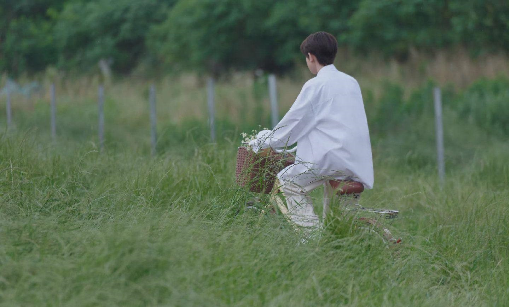

影视剧、书籍、音乐和生活方式推荐

下面会介绍我推荐的、我最近在看的影视剧、书籍、音乐和生活方式，说实话我认为这种“生活态度”的安利是极具私人性的，毕竟，它们组成了我个人。不过我不介意，因为我更看重它们对我来说的其他意义：记忆和成长。因此我会持续更新的~ 

不论是想要了解我还是想要接受我的安利，都请继续关注吧！ 

## 影视
### 电影
 - [还有明天](https://movie.douban.com/subject/36445098/) 2023
观影过程中以为和国内[出走的决心-2024](https://movie.douban.com/subject/36587974/)剧情类似，结果！我还是太狭隘了！！强烈推荐
 - [老娘与海 **又名：泳者之心**](https://movie.douban.com/subject/26656728/) 2024
 - [妇女参政论者](https://movie.douban.com/subject/25821498/) 2015

### 连续剧
- [无耻之徒](https://movie.douban.com/subject/1474087/) 2004-2020 **忽略frank的不负责任真的是最爱frank！**
- [我的天才女友(意大利)](https://book.douban.com/subject/27204805/) 2018-2024
关键词：书籍《那不勒斯四部曲》改编：我的天才女友、新名字的故事、离开的，留下的、失踪的孩子
很细腻的女性作家书写的两名女性的友谊：复杂、既有爱又有恨和期待；很喜欢两个女生以各自的速度成长。
- [伦敦生活](https://movie.douban.com/subject/26838164/) 2016-2019
- [影后(台湾)](https://movie.douban.com/subject/36085524/) 2024 **太爱杨谨华！**
- [人生复本]():看过[瑞克和莫蒂]()的应该不会被这个电影惊艳到，'薛定谔的猫'系列科幻片 2025.2

### 动漫
- 刺客伍六七：超级轻松搞笑！！！

## 书籍
- [厌女：日本的女性厌恶——上野千鹤子](https://book.douban.com/subject/25836270/) 2015
关键词：男性同性社会性欲望homosocial、厌女misogyny、同性恋憎恶homophobia、厌女症：男性对女性的蔑视和女性的自我厌恶
理论性还是比[从零开始的女性主义](https://book.douban.com/subject/35523099/?icn=index-latestbook-subject)要高得多，而且翻译感好重，什么时候国内女性主义作家能把[男人之间](https://book.douban.com/subject/6722209/)用国内的历史和语言文化，在近代的情况下进行更新的分析呢？希望！
- [始于极限——上野千鹤子](https://book.douban.com/subject/35966120/?icn=index-topchart-subject) 2022 **正在阅读**
- [蛤蟆先生去看心理医生——罗伯特·戴博德](https://book.douban.com/subject/35143790/) 2020 **第二次阅读**
- [双重赔偿]() 2个小时就能看完的精彩小说！2025.2
## 音乐
- 歌手：
 - 别野加奈：很适合专注时的背景音会，让人平静下来

## 生活方式
### 播客：
- 文化有限：每期对应一本**书**
- 凹凸电波：搞笑的一群朋友们闲谈，听起来轻松
- 燕外之意：针对某一主题对网友的经历汇总
- 思文败类：轻松+小思考
- 随机波动：感性、深邃的女性在谈论中思考
- 岩中花述：鲁豫的对谈，最近都是"she"她主题的女性嘉宾
### 运动：
- 健身：争取引体向上
- 攀岩：新时代不分性别的"裹小脚"
- 网球：希望对球的控制更稳定一些
- 游泳：谁能想到每周都在坚持游泳！

> github: [pljj315](https://pljj315.github.io)

