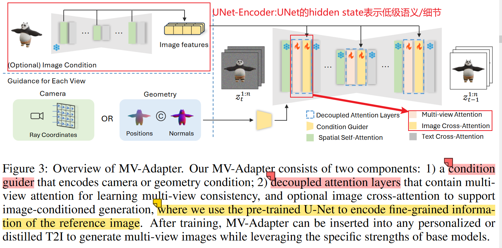
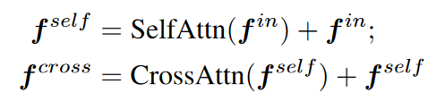
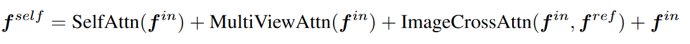
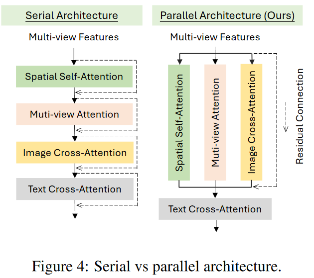
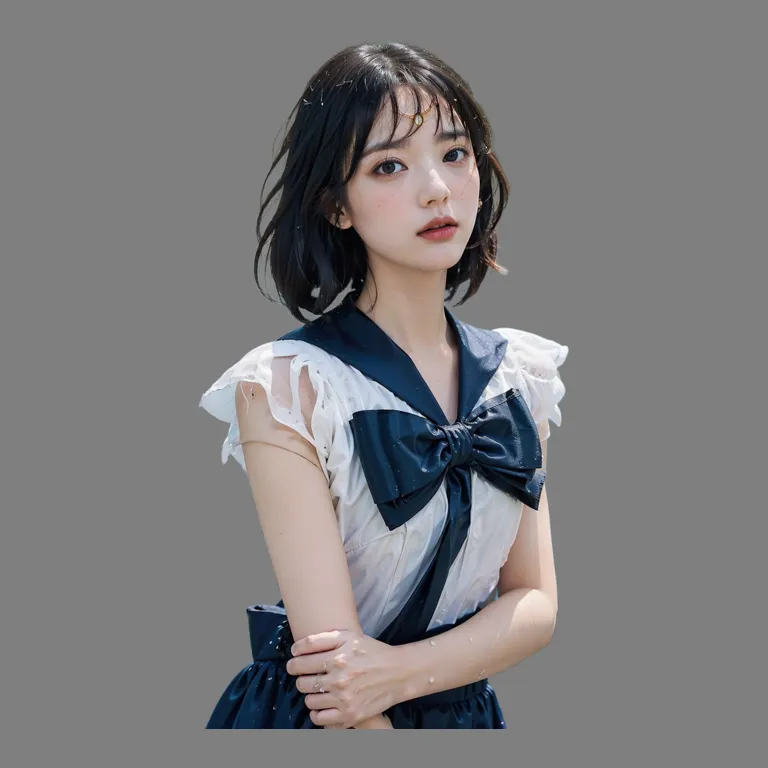
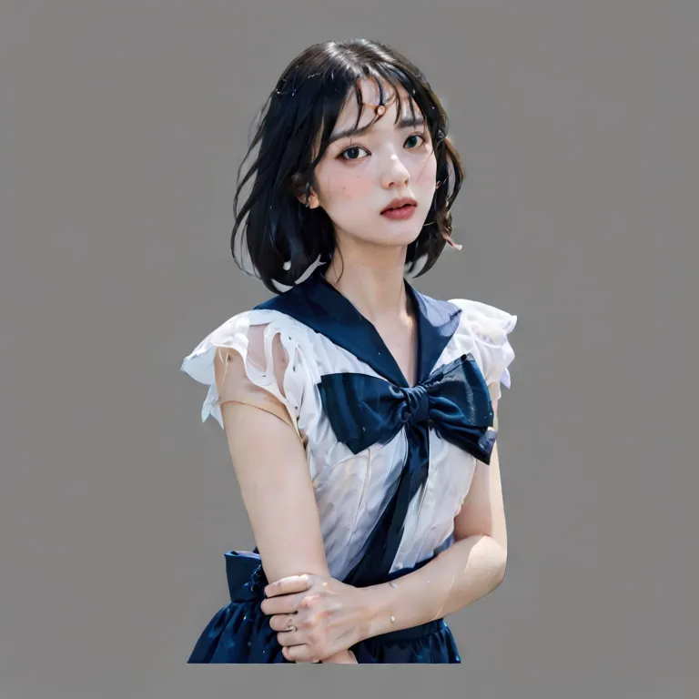

# Paper-Reading：MULTI-VIEW CONSISTENT IMAGE GENERATION MADE EASY - 2024.12

**关键概括：**训练了一个即插即用的adapter，能够在各种diffusion模型下，通过相机参数或者几何信息对视角进行指导，进行**多视角的一致性角色生成**。

- **decoupled attention mechanism**：新的自注意力层来源于对原自注意力层的复制 + 平行的自注意力连接架构【原spatial_self_attention与多个其他的attention平行连接！】
- **condition-guider**：能够对相机参数和几何信息进行编码的“新的条件编码器(condition encoder)"

**优点：**

- 即插即用，尽可能保留了底模(base model)的性能
- 训练容易，只需要微调几个adapter层而不是整个UNet：参数量小，数据集友好

## 方法：

### 1. pipeline:

包括一个condition-guider encoder; 和decoupled attention mechanism

------

### 2. condition-guider==> encoder：

- conditioning map：
  - 相机位姿：raymap
  - 几何信息：position_map + normal_map
- encoder结构：一系列的卷积网络==>包括feature extraction blocks特征提取 + downsampling layers下采样调整scale

### 3. decoupled attention mechanism：

- 自注意力与其他注意力的连接方式不再是原始的级联，如下图所示：

- 并联架构，如下图所示：
- 级联注意力架构  vs  并联注意力架构，对比如下图所示：

- 其中：
  - spatial self-attention：即原始的自注意力层，Q=K=V=hidden states，表示图片本身不同位置的关注度；
  - **multi-view attention**：较为复杂，是多视图的实现关键！
  - image cross-attention：Q = hidden states, K=V=来自冻结UNet对参考输入图提取得中间表示，即把冻结的平行UNet【被叫做UNet Encoder】作为了一种特征提取器，提取低级语义的特征和细粒度的细节；

### 训练：

- 数据集：Objaverse dataset

- randomly zero out the features of the reference image to drop image conditions, enabling classifier-free guidance at inference：解释：对于CFG的训练策略，是在训练过程中按照比例（如0.1）随机丢弃**条件信息**，这里的“条件信息”一般是额外的(**cross attn的K、V来源？**)指导信息，比如文生图中的文本(text embedding)，这里丢弃的是**参考图像特征**

  

### 待解决：

- shift the noise schedule towards high noise levels

- shift the log signal-to-noise ratio by log(n), where n is the number of generated views.

- **multi-view attention**部分没有细致的研究，row-wise self_attention column-wise self-attention是什么？

### 测试实例：

输入、输出=768分辨率

.webp)

.webp)

.webp)

.webp)
