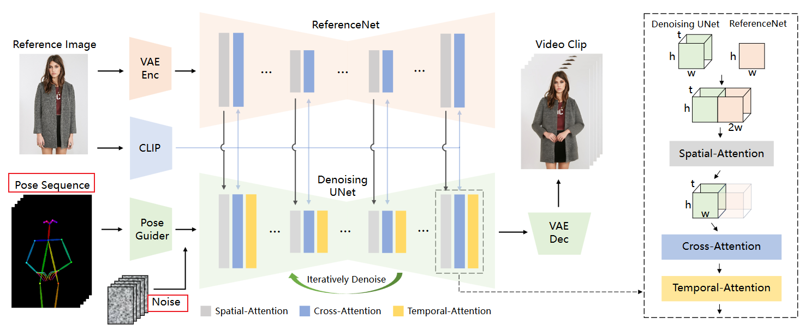
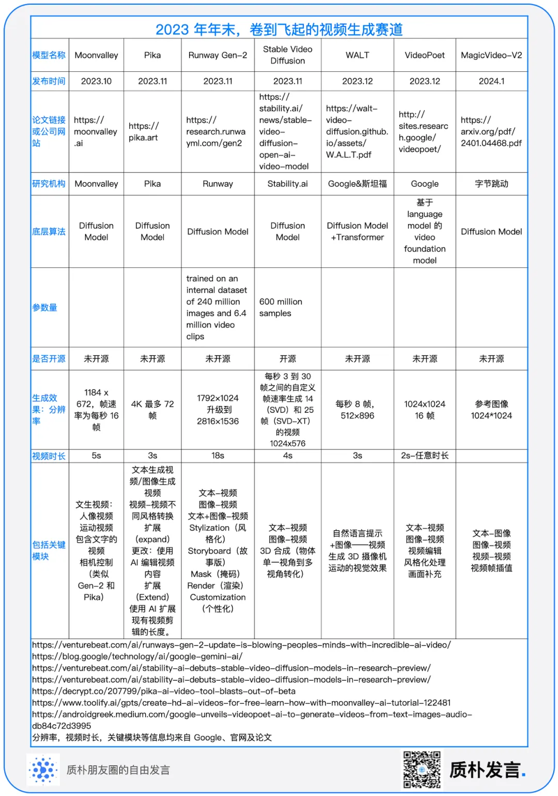

#  Diffusion based methods:

图生视频：

1. 文生**图**模型 + 时序建模：时序建模技术包括：“inter-frame attention”即temporal-layers，或者motion_module；
2. 文生**视频**模型 + 图片特征：视觉特征提取（CLIP-image-encoder、Parallel-UNet-encoder / ControlNet），latent初始化；

- Animate-Anyone【图生视频】
- Stable Video Diffusion(SVD)

## 1. Stable Video Diffusion：StabilityAI 2023.11

## 2. AnimateDiff：2023.11 略

## 3. Animate-Anyone：阿里巴巴-通义 2023.12

1. 贡献点：

   - ReferenceNet: 平行的UNet-encoder提取参考人物细节特征【优点：相比于CLIP-Image-encoer的输入分辨率只能224*224且强调语义，能够接受更大的分辨率输入且强调细粒度细节特征和语义，】

   - Pose Guider: 姿势控制器: 高斯权重、零投影初始化，加到noise_latent上

   - Temporal-Attention: 时序注意力层：确保帧间的空间、时间连续性，串联在两个注意力机制后：沿着 t 维度进行自注意力机制

     `Specifically, for a feature map x∈b×t×h×w×c, we first reshape it to x∈(b×h×w)×t×c, and then perform temporal attention, which refers to self-attention along the dimension t.`

2. 训练策略：

   - 两阶段：
     - 先使用没有 Temporal-Attention 时序注意力层的网络训练Pose Guider：使用单帧；
     - 再只训练 Temporal-Attention 模块，权重由 AnimateDiff 初始化：使用24帧；
   - 测试指标：SSIM， PSNR， LPIPS，FVD

3. 局限：

   - 手部运动失真、模糊
   - 单视角参考：背面生成有不稳定

# Transformer based methods:

- CogVideo

