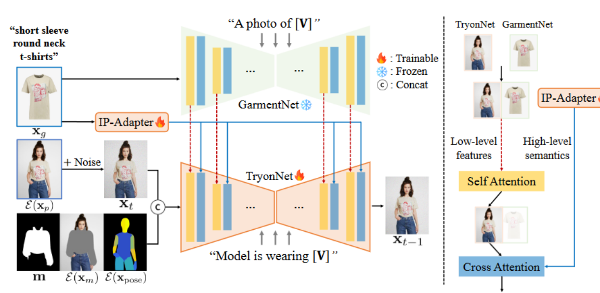
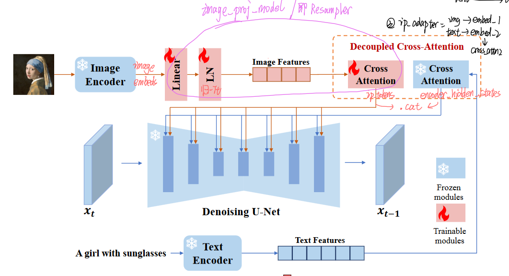

## IDM-VTON: Improving Diffusion Models for Authentic Virtual Try-on in the Wild (in 2024 ECCV)


论文概括：论文中提出了一种改进的扩散模型 (Improved Diffusion Models for Virtual Try-ON, 简称IDM–VTON)，使其应用在真实世界场景下虚拟试穿任务。该模型显著提高了服装图像的一致性，可以生成真实的虚拟试穿图像。具体地，设计一个复杂的注意力模块(attention modules)，可以将服装图像更好的编码到扩散模型，该注意力模块由两个不同的组件组成：

- 作用在self-attention——IP-Adapter：对图片形式的服装提示进行编码适配(image prompt adapter)【高级语义】
- 作用在cross-attention——GarmentNet：同样对服装图片进行编码，不过使用UNet的hidden_state直接得到特征，保留细粒度的细节【低层特征】


<!--more-->


### 方法

#### IDM-VTON整个模型框架由三个部分组成：

- TryonNet：13通道的UNet，以常见的9通道InpaintingModel作为初始化+4通道的pose map latent
- IP-Adapter：提取服装高级语义**【代码中并没有训练？】**
- GarmentNet：基于UNet的特征编码器，提取服装的低级特征，直接使用冻结的SDXL-base



#### 1. TryonNet 详解

TryonNet的输入由4个部分组成，共13通道=4+4+4+1：除了单通道的mask外，均为4个通道（VAE编码层获得latent是4通道）：使用开源的9通道SDXL-Inpainting模型作为初始化，并使用卷积层来修改UNet的输入特征通道（卷积层初始化为0）。代码如下:

```python
unet.encoder_hid_proj = image_proj_model

conv_new = torch.nn.Conv2d(
    in_channels=4+4+1+4,
    out_channels=unet.conv_in.out_channels,
    kernel_size=3,
    padding=1,
)
torch.nn.init.kaiming_normal_(conv_new.weight)  
conv_new.weight.data = conv_new.weight.data * 0.  # 初始化为0 

conv_new.weight.data[:, :9] = unet.conv_in.weight.data  
conv_new.bias.data = unet.conv_in.bias.data  

unet.conv_in = conv_new  # replace conv layer in unet
unet.config['in_channels'] = 13  # update config
unet.config.in_channels = 13  # update config
#customize unet end
```
#### 2. IP-Adapter 详解

使用IP-Adapter对服装图像进行编码，使用冻结参数的CLIP图像编码器（即 OpenCLIP ViT-H/14）来提取特征。论文说IP-Adapter【包括特征投影层（feature projection layers）和交叉注意层（cross-attention layers）】是可训练的，*但代码里并没有训练*，社区的issues也提到了不训练可能会更好：ipa可能会影响到衣服颜色准确度*。 



#### 3. GarmentNet 详解

- 由于 **CLIP 图像编码器缺乏提取服装的低级特征（CLIP训练的文本图像对比较广泛，对服装细节无法详细的描述）**，导致：虽然IP-Adapter已经引入了来自服装图像的控制，但当服装具有复杂的图案或印花时，IP-Adapter在保留服装的细粒度细节方面存在不足。而SDXL模型在大规模数据集上经过预训练，已经具备了良好的低级特征提取器的能力，可以作为对IPA的细粒度特征的补充特征。

- 具体实现可以理解为：来自两个UNet网络的低层次特征 (Low-level features) 先通过**自注意力**进行特征融合，再和来自IP-Adapter的高级语义（High-level semantics）通过**交叉注意力**进行特征融合
  - **冻结SDXL-base的UNet网络参数**，并获取其hidden state中间表示作为低级特征
  - 与来自TryonNet的中间表达进行连接，然后计算连接特征的自注意力(Self Attention)
  - 只传递来自TryonNet的前半部分特征，将其与IP-Adapter结果特征进行交叉注意力(Cross Attention)计算并继续传递

#### 4. 使用更详细的Caption：对服装的细节进行精细描述


更详细的描述有助于模型使用自然语言对服装的高级语义进行编码，对基于图像的信息进行补充。[V]，即 cloth_annotation 通过图像注释器（image annotator，对图片中的特定属性进行分类识别）获得。

```
替换公式：
[V] = short sleeve round neck t-shirts
A photo of [V] = A photo of short sleeve round neck t-shirts
Model is wearing [V] = Model is wearing short sleeve round neck t-shirts

代码：
result["caption"] = "model is wearing " + cloth_annotation
result["caption_cloth"] = "a photo of " + cloth_annotation
```
``` python 
annotation_list = [ # 
    # "colors",
    # "textures",
    "sleeveLength",
    "neckLine",
    "item",
]

self.annotation_pair = {}
for k, v in data1.items():
    for elem in v:
        annotation_str = ""
        for template in annotation_list: # 遍历 annotation_list，依次提取每一项的分类结果，对字符串进行连接获得最终描述
            for tag in elem["tag_info"]:
                if (
                    tag["tag_name"] == template
                    and tag["tag_category"] is not None
                ):
                    annotation_str += tag["tag_category"]
                    annotation_str += " "
        self.annotation_pair[elem["file_name"]] = annotation_str
```

-----

