>前言：基于扩散/流生成模型中的图像编辑：
>
>- test-time optimization：规模性的微调训练，如FLUX-Fill 模型、FLUX-redux万物迁移
>- optimization-free：
>  - Inversion-reconstruction：如 RF-Inversion，RF-Edit，并不能算“编辑”，更像“图生图”，适合风格迁移，无法背景保持，**耗时 step*2**
>  - Inversion-free：如 Flow Edit，不再借助反演的中间的高斯噪声分布，但并没有节省时间消耗，依然 **耗时 step*2**
>  - Inversion-based-cache：借助Inversion，并在采样时注入Inversion得到的中间表示【如：序列token，V，k&V，等】，**耗时 step*2**——> 实现结构保留的图像编辑！！！
>    - RF-Edit：注意力共享：替换 V【单流自注意力中的V_ref】
>    - KV-Edit：注意力共享：替换 K & V
>    - Personalize Anything：图像token替换，位置编码ids的实验探究


什么是Inversion? 

扩散的Inversion如何实现？ 

FLow_based的Inversion如何实现？


阅读博文：

- [Diffusion Inversion技术](http://blog.csdn.net/weixin_44966641/article/details/138804404)


flux代码：

`sigmas = np.linspace(1.0, 1 / T_steps, T_steps) `从1~0均匀取值，但是取不到0,最后一位==(1/T_steps)!!!!

VAE：16通道，8倍压缩比 = pipe.vae_scale_factor=8， patchify图块化2*2的两倍压缩比,  FLUX总压缩比16

加噪：`Z_t= (1-t)*Z_0 + t*N_t, N_t~正态分布(0,1)`  scale_noise函数中实现；

去噪：`latents = self.scheduler.step( noise_pred, t, latents, return_dict=False )[0]`

FluxTransformer2DModel.FluxAttnProcessor2_0个数：57 == single_transformer_blocks：38 + transformer_blocks：19

``` python
class FluxTransformer2DModel
    def __init__(
            self,
            patch_size: int = 1,
            in_channels: int = 64,
            out_channels: Optional[int] = None,
            num_layers: int = 19,           # 双流MM-DiT :'transformer_blocks.18.attn.processor'
            num_single_layers: int = 38,    # 单流DiT    :'single_transformer_blocks.37.attn.processor'
            attention_head_dim: int = 128,
            num_attention_heads: int = 24,
            joint_attention_dim: int = 4096, # img_dims
            pooled_projection_dim: int = 768,
            guidance_embeds: bool = False,
            axes_dims_rope: Tuple[int] = (16, 56, 56), )
    def attn_processors()
    def set_attn_processor()
    def fuse_qkv_projections()
    def unfuse_qkv_projections()
class FluxTransformerBlock(nn.Module)
class FluxSingleTransformerBlock(nn.Module)
```


## 1. Inversion in flow_matching models:

### 1.1 RF-Inversion： Semantic Image Inversion and Editing using Rectified Stochastic Differential Equations——谷歌【收入diffusers】

1. 理论性强，没看懂;

2. 被收入diffusers: 在：`examples/community/pipeline_flux_rf_inversion.py`中的`FlowMatchEulerDiscreteSDEScheduler`

   >注意：diffusers中`FluxPipeline`默认的flux采样器是`FlowMatchEulerDiscreteScheduler`
   >
   >RF-Inversion需要自己拉仓库导入上述`FlowMatchEulerDiscreteSDEScheduler`

3. invert参数固定：gamma=0.5，inversion直接利用ref的latent_image_ids

4. 代码：

   ```python
   # pipeline.invert
   
   # Eq 8 dY_t = [u_t(Y_t) + γ(u_t(Y_t|y_1) - u_t(Y_t))]dt
   Y_t = image_latents
   y_1 = torch.randn_like(Y_t)
   N = len(sigmas)
   
   # forward ODE loop
   with self.progress_bar(total=N - 1) as progress_bar:
       for i in range(N - 1):
           t_i = torch.tensor(i / (N), dtype=Y_t.dtype, device=device)
           timestep = torch.tensor(t_i, dtype=Y_t.dtype, device=device).repeat(batch_size)
           # print(text_ids.shape, latent_image_ids.shape)
           # get the unconditional vector field
           u_t_i = self.transformer(
               hidden_states=Y_t,
               timestep=timestep,
               guidance=guidance,
               pooled_projections=pooled_prompt_embeds,
               encoder_hidden_states=prompt_embeds,
               txt_ids=text_ids,
               img_ids=latent_image_ids,
               joint_attention_kwargs=self.joint_attention_kwargs,
               return_dict=False,
           )[0]
   
           # get the conditional vector field
           u_t_i_cond = (y_1 - Y_t) / (1 - t_i)
   
           # controlled vector field
           # Eq 8 dY_t = [u_t(Y_t) + γ(u_t(Y_t|y_1) - u_t(Y_t))]dt
           u_hat_t_i = u_t_i + gamma * (u_t_i_cond - u_t_i)
           Y_t = Y_t + u_hat_t_i * (sigmas[i] - sigmas[i + 1])
           progress_bar.update()
   ```

   ```python
   # 推理pipeline.call：
   if do_rf_inversion:
       v_t = -noise_pred
       v_t_cond = (y_0 - latents) / (1 - t_i)
       eta_t = eta if start_timestep <= i < stop_timestep else 0.0
       if decay_eta:
           eta_t = eta_t * (1 - i / num_inference_steps) ** eta_decay_power  # Decay eta over the loop
       v_hat_t = v_t + eta_t * (v_t_cond - v_t)
   
       # SDE Eq: 17 from https://arxiv.org/pdf/2410.10792
       latents = latents + v_hat_t * (sigmas[i] - sigmas[i + 1])
   else:
       # compute the previous noisy sample x_t -> x_t-1
       latents = self.scheduler.step(noise_pred, t, latents, return_dict=False)[0]
   ```

   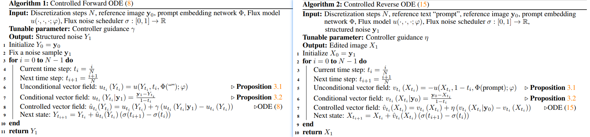

   

### 1.2 RF-Edit: Taming Rectified Flow for Inversion and Editing——腾讯

1. ODE  泰勒展开 + 一阶导近似
2. 为增强细节保留在Edit时利用了**注意力共享**: Inversion + 替换V【单流自注意力中的V_ref】

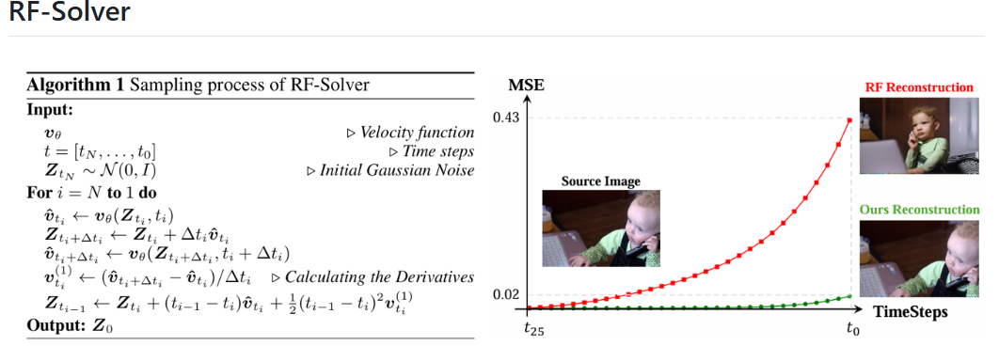

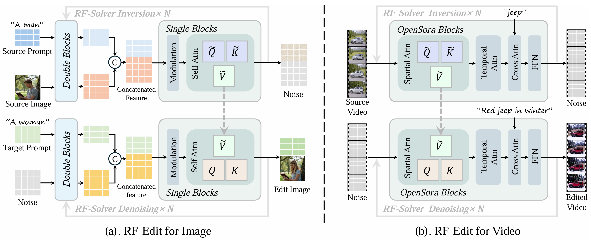

### 1.3  FlowEdit： Inversion-Free Text-Based Editing Using Pre-Trained Flow Models 2024.12

1. 理论创新：
   - 没去实现Inversion找中间高斯噪声的步骤，而是直接从源分布到目标分布【近似noise_free】，并在实际操作时根据n_avg取平均;
   - Noise_free的路径：分布转换的路径消耗更小，会更好；

2. 耗时依旧：但由于实现过程中的每一step都需要使用FLUX模型推理两次（v_tar、v_src），实现起来**依然需要 2*steps!**，与inversion方法相比并没有实质性的耗时优化；

3. 代码：**image_ids复制了src的image_ids**

```python
latent_tar_image_ids = latent_src_image_ids： 导致如果n_min=0会存在ref原图的伪影
```

4. inversion vs FlowEdit 路径对比以及FlowEdit伪代码：

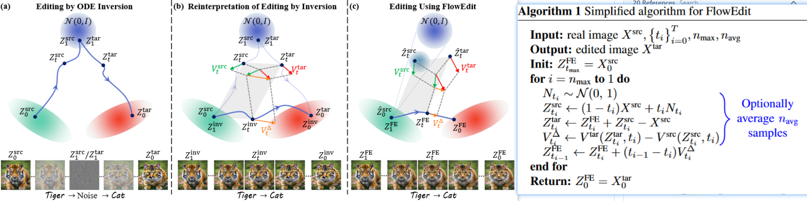

5. 测试：

   - n_min：伪影解决：timestep = 28,  n_max = 24, n_min =0, n_avg=1:  n_min设置为较小的数，能够在后期去噪阶段进行正常flow去噪，把伪影去掉；

     > timestep 是去噪的全部步数，去噪时倒着数：从28,27，一直到1；
     >
     > 原论文代码中设置：
     >
     > - timestep--n_max：不进行处理
     > - n_max--n_min：flow_edit处理
     > - n_min--1：正常flow去噪处理

     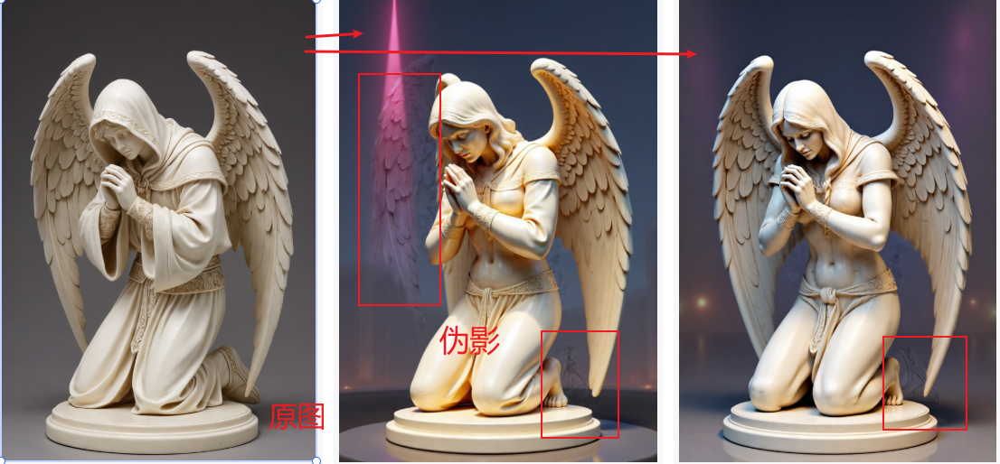

   - n_max：n_max的设置见SDEdit论文，调整了编辑的强度，n_max越大，编辑强度/程度越大

     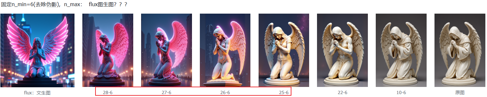

## 2. Inversion_based_editing:

### 2.1 RF-Edit: inversion+ 替换单流自注意力中的 V (上文讲过)

1. ODE  泰勒展开 + 一阶导近似
2. 为增强细节保留在Edit时利用了**注意力共享**: Inversion + **替换V【单流自注意力中的V_ref】**


### 2.2 KV Edit: inversion + 拼接 K & V——背景保留能力 2025.3

论文：

1. 如何实现inversion？

   ```python
   类似于RF-Inversion，没有使用condition control
   ```

2. 反演步骤：包括前景和背景的分离反演，耗时*2？？？:

   - 前景反演：获得前景对应的高斯分布噪声分布，以作为去噪的初始表示
   - 背景反演：获得反演过程中的**cached-K_bg / cached_V_bg，以指导去噪的背景保留**

3. 去噪步骤：

   - 初始表示：除了removal任务使用reint（加入随机噪声）外，其他均使用反演步骤得到的前景反演噪声XN_fg
   - **双流交叉注意力中：拼接来自背景的K/V**？具体如何实现

针对object removal：

- re-init : `after inversion, we replace ztN with fused noise z′tN = noise·tN +ztN ·(1−tN )`disrupt the original content information.
- `incorporate an attention mask during the inversion process`

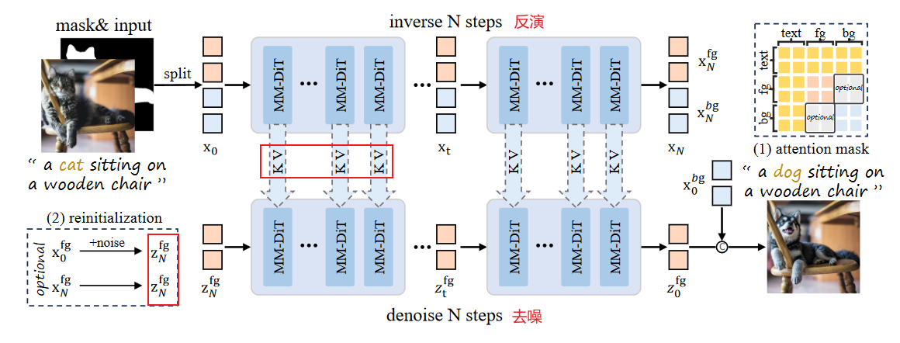

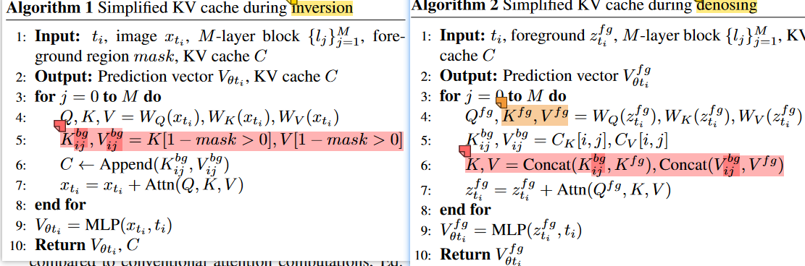

有些不明白的描述——看代码：

`Q_fg represents queries containing only foreground tokens`

`(Kfg, Kbg) and (Vfg, Vbg) denote the concatenation of background and foreground keys and values in their proper order (equivalent to the complete image’s keys and values),`

crop  fg操作？？？`performing cropping at both input and output of the attention layer,`

提出改进：是否可以更近一步K V不使用contencate，而是替换？：personalize anything是对图像token_ref替换，同时对位置编码也做了操作


### 2.3 Personalize Anything: inversion + 图像序列替换——inpaint、outpaint、个性化保持 2025.3

1. 如何实现inversion：RF-Inversion【代码】，RF-Edit【论文】
2. 反演步骤：
   - 获得cached_tokens【无位置ids信息】:只获得语义token，不要位置
3. 去噪步骤：
   - 无位置ids信息的 cached_tokens **替换replace** position_encoded denoising tokens：无伪影，对ref关注，利于重建ref
   - 替换的具体实现：依赖于mask：X`= X ⊙ (1 − M) + X_ref ⊙ M，其中M可以经过任意**平移**；
   - **timestep-adaptive token replacement**：
     - 在去噪的前期阶段执行**替换**
     - 在去噪的后期阶段：**拼接** 【denoising_tokens，零ids置为的ref_tokens，text_tokens】执行MMA多模态注意力：增强语义能力
   - **Patch Perturbation for Variation**：减少过拟合
     - 3*3window 打乱ids
     - Mask的增强：膨胀 腐蚀
4. 消融实验：
   - position_encoded denoising tokens 与 position_encoded cached_tokens **拼接**：两者的ids都保持：产生ref伪影——DiT对ids位置很敏感
   - position_encoded denoising tokens 与 全部ids置为(0,0)或者平移后的（i+w, j） 的 cached_tokens **拼接**：对ref不产生关注
5. 多任务能力：
   - Mask的灵活移动性带来了：布局引导
   - 多主体生成
   - 图像编辑：disable perturbations and set τ to 10% total steps：inpaint、outpaint

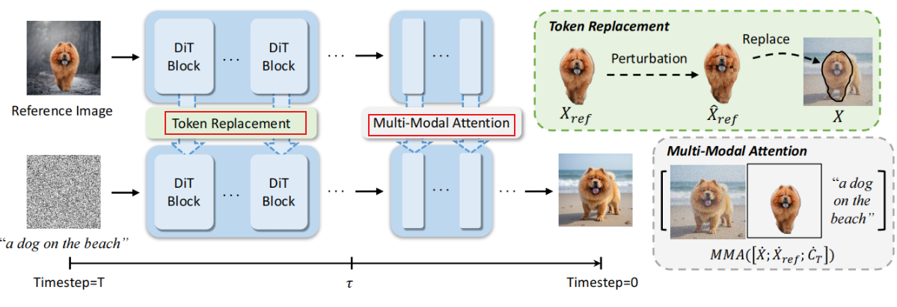

6. 测试：

   缺：**ref_token的替换并不能十分严谨的重建/保持主体特征，而且inpaint内外不连贯**，需要依赖于tau阈值参数的调整，

   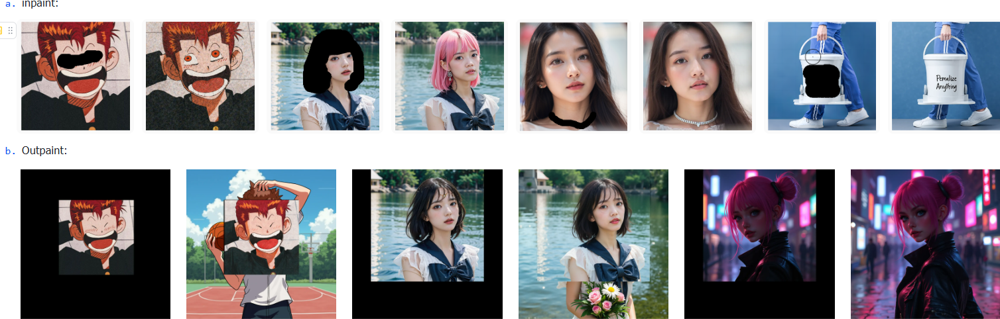

7. 代码：

   - RFInversionParallelFluxPipeline：

     ```python
     # pipeline_flux_rf_inversion:与RF-Inversion相同
         inverted_latents, image_latents, latent_image_ids = pipe.invert( 
             source_prompt="",  # 使用空描述
             image=init_image, 
             height=height,
             width=width,
             num_inversion_steps=timestep, 
             gamma=1.0)
     # pipe.forward():执行ref_tokens替换的图像编辑生成：# 新增参数inverted_latents、start_timestep、stop_timestep： 去噪过程中timestep从1-0逐步减小！
     
     latents = inverted_latents
     new_latents, _ = self.prepare_latents(1,..., generator,latents=None,)
     latents = torch.cat((latents, new_latents), dim=0) # [0]:inverted_noise_latent, [1]:rand_noise_latent
     ```

   - set_flux_transformer_attn_processor：定义attn processor，每次不同的任务都需要重新定义

     ```python
     # img_dims: 图像latent序列长度，VAE8倍压缩比 = pipe.vae_scale_factor=8， patchify图块化2*2的两倍压缩比, 总压缩比16
         set_flux_transformer_attn_processor(
             pipe.transformer,
             set_attn_proc_func=lambda name, dh, nh, ap: PersonalizeAnythingAttnProcessor( name=name, tau=tau/100, mask=mask, 					shift_mask=shift_mask, device=device, img_dims=img_dims, concept_process=False),) 
     # 通过每次重新定义attn processor来实现mask、tau阈值、shift_mask、concept_process等参数传递：shift_mask、mask
     ```

   - PersonalizeAnythingAttnProcessor、MultiPersonalizeAnythingAttnProcessor 对比原始 FluxAttnProcessor2_0

     ``` python
     # FluxAttnProcessor2_0：在q k v 获得后，attention计算之前，添加旋转的位置编码：
         if image_rotary_emb is not None:
             from .embeddings import apply_rotary_emb
     
             query = apply_rotary_emb(query, image_rotary_emb)
             key = apply_rotary_emb(key, image_rotary_emb)
     
     # PersonalizeAnythingAttnProcessor.forward()：多了timestep参数:由self._joint_attention_kwargs["timestep"] =进行传递
         # concept_feature_    r_hidden_states？？？？
         if encoder_hidden_states is not None:
             concept_feature_ = hidden_states[0, self.mask, :]  #  self.mask = mask.view(img_dims).bool().to(device)
         else:
             concept_feature_ = hidden_states[0, 512:, :][self.mask, :] # flux使用512个text_tokens
     
         if r_k or r_q or r_v:
             r_hidden_states = hidden_states
             if encoder_hidden_states is not None:
                 r_hidden_states[1, self.shift_mask, :] = concept_feature_
         else:
             text_hidden_states = hidden_states[1, :512, :]
             image_hidden_states = hidden_states[1, 512:, :]
             image_hidden_states[self.shift_mask, :] = concept_feature_
     
             r_hidden_states[1] = torch.cat([text_hidden_states, image_hidden_states], dim=0)
     ```

     


insight: 视频大模型具有对物理规律的理解，光照光影位置关系等，可以利用视频大模型的先验进行图片领域上的任务，如图像编辑、多视图生成

style-align

Training-Free Consistent Text-to-Image Generation

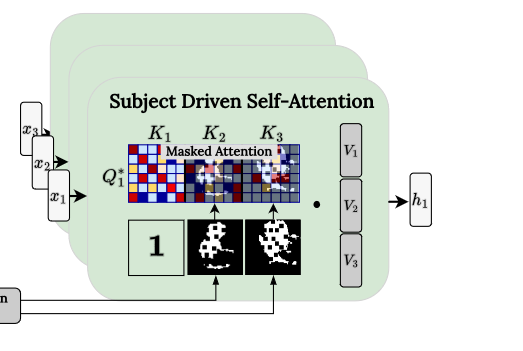