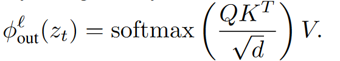
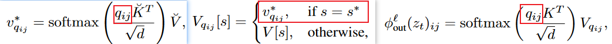
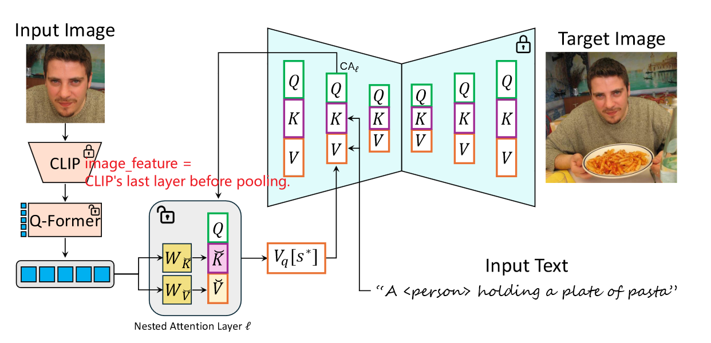
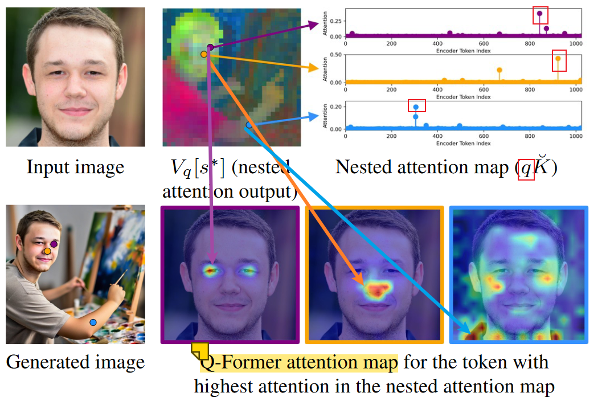

# [**Nested Attention:** Semantic-aware Attention Values for Concept Personalization-2025](https://snap-research.github.io/NestedAttention/)

关键概括：injects a rich and expressive image representation into the model’s existing cross-attention layers. ==>  **single textual-token**、**cross-attention: Nested Attention**、 **smaller semantic visual elements**、 **多个定制化概念**、**可以非人 数据集低需求**  

personalization技术发展路线：text-embedding/fine-tuning based——>cross-image attention based——>***encoder-based（本文）***✨

<!--more-->

## 1. 如何理解per-query attention values?

### 回顾cross-attention

Query: hidden_states(来自unet中间层)

Key & Value: text_embedding(来自text-encoder)

Q 与 K 的点积意义：表示当前空间位置下的 Q_ij 与 K 的语义相似性，即权重，用来后续与 V 加权。由此，在给定文本（K / V ）下，Q的能够决定图像内容的“空间位置”，也就是控制了图像的“外观”！这是文章着重研究 Query 的原因。

### per-query attention Values

原文提取：per-query attention Values = localized values that depend on the queries=per-region values=query-dependent values

Value: text_embedding(来自text-encoder)，由于 Value由不同的token对应的embedding组成，而一个token却要指示着图片*整个区域*的全部相关实例和相关内容，这很“粗粒度”，无法达到任务期待的“细粒度”个性化生成【value中的每一个embedding要负责整个query，任务重，容易完成的不好】。因此把任务细分：划分query，每个子query由专门的新value负责，减轻了value的任务量。即：提出了更局部的“localized Values”：能更好的关注到局部区域、细粒度的语义信息。

所谓的“per-query attention Values”具体是怎样实现的就是下面的内容了。

> 注意：per-query attention Values ≠ attention map的值，Values指的是Q K V中的V。

## 2. 如何理解nested attention mechanism？

其中公式1就是上文的“per-query attention Values”的实现方式了。简单来说，就是对special token（s*）在不同的空间位置（i,j）下的q_ij，单独预测value_ij，这样得到的value_ij便具有了更局部的、细粒度的语义信息。但不是所有的text token都是用这个机制，只有要被个性化的special token会用到，这种注意力机制就是nested attention mechanism。

> 注意，Key 在公式1和3中的区别！(从左到右分别：公式1/2/3)
> 文中还提到了对“per-query attention Values”的正则化实验技巧，不具体介绍。

## 3. q_ij、nested keys、nested values从哪来？——可训练模块

Q-Former得到：”Q-Former learned queries“，即q_ij；

nested attention layers[ linear layers ]得到：nested keys、nested values；

上述两个模块组成了文章的可训练部分，得到的q_ij、nested keys、nested values三者构成公式1的输入。

> 注意：per-query attention Values ≠ nested values, 二者关系：nested values 和 nested keys 经过公式1 得到per-query attention Values。
>
> clip image features = CLIP 's last layer before pooling

## 4. 对“Q-Former learned queries”的验证：

从生成过程中的Query中取3个不同空间位置的q_ij，与nested keys进行点积运算得到attention map'，可以观察到总能有1-2个nested token与q_ij最相关；进一步将q_ij、nested keys、nested values按照公式1进行运算，得到Q-Former learned queries，与输入脸部图像的clip image features 进行点积运算得到attention map, 能直观的观察到Q-Former learned queries的作用，即生成的细粒度特征在输入图中的来源相关性。

