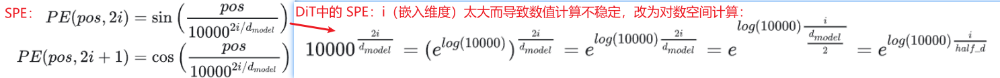

多模态理解与生成 分类：

- 基于扩散的：都是估计一种分布转换
  - 基于扩散Diffusion:  ϵ -Prediction，UNet、DiT、MM-DiT；估计噪声/数据分布，不限定==>也就是走曲线的概率密度转换路径：**缺：训练时间长采样慢**
    - 前行过程：通过不可学习的Schedule 对样本进行加噪，多次加噪变换为正态分布
    - 反向过程：从正态分布采样，并通过模型隐式的学习反向过程的噪声，去噪得到生成的样本【迭代多步生成】
  - 基于流Flow： v -Prediction，DiT、MM-DiT；估计向量场/速度场，尽量走直线的概率密度转换路径，与扩散落实在代码上的区别是“训练目标函数和采样函数”
    - 前行过程：通过显式的可学习的可逆变换将样本分布变换为正态分布
    - 反向过程：从正态分布采样，并通过上述变换的逆变换得到生成的样本【近似直线一步生成】
- 基于自回归的：各种AR的序列预测顺序
- 基于扩散+自回归的

基础框架：

- Transformer：decoder-only transformer？
- Diffusion-Transformer（DiT）
- MM-DiT

### 2. Flow-based Method 原理理解：

阅读博文：

- Rectified Flow论文原作者的中文解读：[ICLR2023\] 扩散生成模型新方法：极度简化，一步生成](https://zhuanlan.zhihu.com/p/603740431)
- [Flow Matching 理论详解](https://littlenyima.github.io/posts/51-flow-matching-for-diffusion-models/index.html)
- [深入理解Rectified Flow，完善统一扩散框架](https://zhuanlan.zhihu.com/p/11686643707)

> flow: 使用时间参数化的向量场来定义一个流函数 **Flow**，从而在连续时间内对概率密度进行变换
>
> marginal distribution: 边际分布？
>
> 可以把Rectified Flow理解为**保持线性插值边缘分布相等的，具有因果的ODE**

常见的Flow-based包括：

- Normalizing Flow：离散可逆变换，对概率分布进行建模，实现从先验分布（即，高斯分布）到目标分布的可逆转换过程并采样生成；
- Continuous Normalizing Flow（CNF）：连续可逆变换【ODE】；
  - Rectified Flow（linear flows）2022.10：**一步沿着直线采样生成【ODE】**：Domain Transfer，两次训练
  - Flow Matching（FM）、Conditional Flow Matching（CFM）2022.10：【ODE】：几乎同上

#### 2.1 Rectified flow 2022.10:

Rectified flow + 【蒸馏 与 Reflow回流的区别】

#### 2.2 Flow Matching --> Conditional FM 2022.10:

先验分布设定为高斯分布，包括μ_t均值函数、sigma_t标准差函数的不同，可以构建不同的高斯条件概率路径：

- **Variance Preserving，VP** 方差保持扩散路径：传输路径轨迹为曲线
- **Variance Exploding，VE** 方差爆炸扩散路径：传输路径轨迹为曲线
- **最优传输（Optimal Transport，OT）** 路径（CFM）：传输路径轨迹为直线，得到更快的训练速度和生成速度、更好的性能表现

###  3. Flow_based Model + Transformer:

#### 3.1 Transformer 原理探究：DiT

博文阅读：

- [Diffusion Transformer（DiT）原理与源码解析 - 知乎](https://zhuanlan.zhihu.com/p/684125968)

ViT = Transformer用在CV领域：将图像进行 patchify 得到固定大小的 patch 序列，作为输入馈送进标准 Transformer Encoder，然后进行下游任务的处理

DiT = 调整Normalization后的ViT + LDM（输入是latent）： 

- TimestepEmbedder:  timestep_embedding(对数正弦位置编码，log_SPE) + MLP结构
- LabelEmbedder: dropout丢弃实现CFG能力
- DiTBlock: SelfAttention、FeedForward、Normalization: DiT 使用 adaln_zero 来代替标准 transformer 中的 Layer Normalization
- Final Layer：
- Patchify： timm.PatchEmbed（）:2*2， SPE位置编码

#### 3.2 SD3 --> [Rectified Flow] _stability.ai 2024.3：Scaling Rectified Flow Transformers for High-Resolution Image Synthesis

**主要贡献**：
**1）改进的[噪声采样技术](https://zhida.zhihu.com/search?content_id=240459073&content_type=Article&match_order=1&q=噪声采样技术&zhida_source=entity)（Improved Noise Sampling Techniques）**：

- 作者针对修正流模型（Rectified Flow Models）提出了一种新的噪声采样方法（**Timestep Samplers**），这种方法通过偏向感知相关尺度（perceptually relevant scales）来提高训练效率和生成图像的质量。这种改进有助于模型在训练过程中更有效地学习数据到噪声的转换过程。
- introducing a re-weighting of the noise scales in rectified flow models：SNR采样器
- 提到了一个diffusion的scheduler缺陷：Common Diffusion Noise Schedules and Sample Steps are Flawed

**2）MM-DiT：novel transformer-based architecture** 文图双向流

#### 3.3 Flux --> [Flow Matching] _Black Forest Labs 没公开论文

博文阅读：

- [FLUX.1 原理与源码解析 - 知乎](https://zhuanlan.zhihu.com/p/741939590)
- [FLUX.1 源码深度前瞻解读](https://zhuanlan.zhihu.com/p/714150390)

主要贡献

- DoubleStreamBlock 双流块 （与MM-DiT几乎相同）
- SingleStreamBlock 单流块 （与DiT几乎相同）

### 4. Transformer 位置编码

阅读博文：

- [Transformer位置编码（基础）](https://zhuanlan.zhihu.com/p/631363482)
- [Transformer学习笔记一：Positional Encoding（位置编码）](https://zhuanlan.zhihu.com/p/454482273)

Positional Encoding：就是将位置信息添加（嵌入）到Embedding词向量中，让Transformer保留词向量的**位置信息**，可以提高模型对序列的理解能力；

1. 为每个字输出**唯一的编码**；
2. 不同长度的句子之间，任何两个字之间的差值应该保持一致？
3. 编码值应该是**有界**的。

位置编码分类：

- 绝对位置编码 `Absolute Position Embedding`：

  - **学习式位置编码（Learned Positional Embedding）**：方法是最普遍的绝对位置编码方法，该方法直接对不同的位置随机初始化一个 `postion embedding`，加到 `word embedding` 上输入模型，**作为参数进行训练**；举例：[BERT](https://link.zhihu.com/?target=https%3A//arxiv.org/pdf/1810.04805.pdf)、[GPT-2](https://link.zhihu.com/?target=https%3A//ailab-ua.github.io/courses/resources/GPT-2_Radford_2018.pdf)

  - **正弦位置编码（Sinusoidal Positional Encoding, SPE）**：是通过将正弦和余弦函数的不同频率应用于输入序列的位置来计算位置编码；

    

- **相对位置编码 `Relative Position Embedding`**：

  - Learned Positional Encoding：通过学习一组可学习参数来计算位置编码- 
  - **旋转位置编码RoPE**

