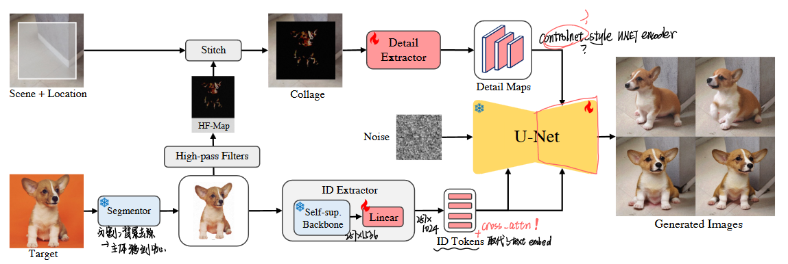
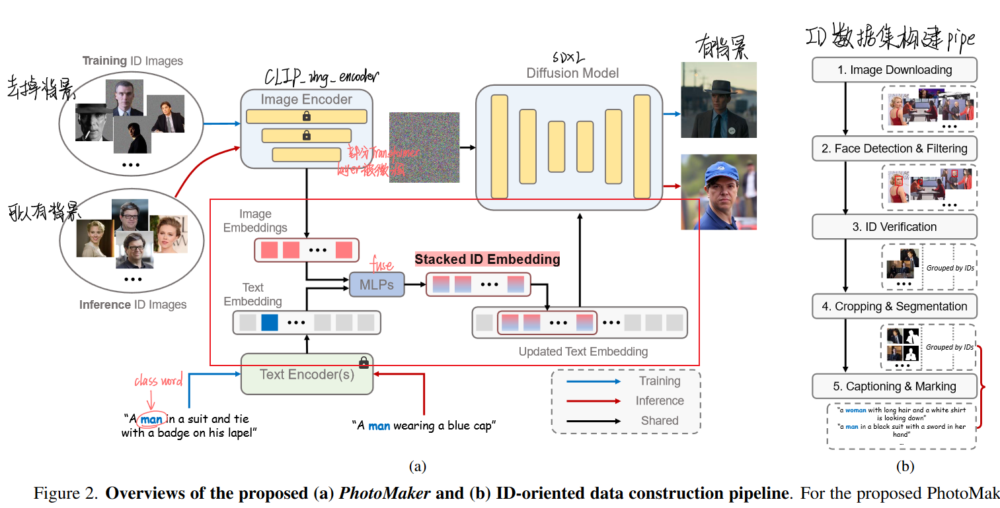
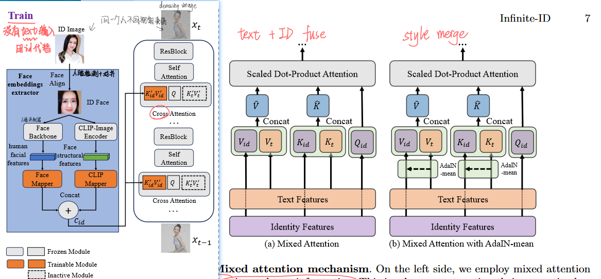
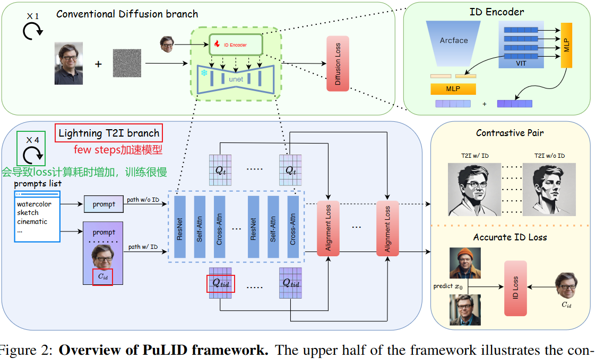

# Research Insights: diffusion VS control

文章目的：从大四接触diffusion到现在已经接近2年，温故而知新，最近在回顾之前阅读过的工作，也总结一下在control方面的技术发展路线，看看能否给带来点启发。谈到control技术的分类，很多工作被统一归纳为“encoder-based methods”，但这种归纳还是太”大“了，这里用我自己的理解做一些更细致的分类，分类依据更偏向于具体的*特征注入机制/控制机制*。

***

encoder-based methods如何理解？：从特征的提取encoder角度入手，着重于将“**不同的image-feature以及不同的特征提取方式**” + “**不同的control控制机制**” 做排列组合。

比如 IC-light 使用可训练的 MLP 提取环境贴图的hdr-envmap-embedding + **stacked into text_embedding**控制机制，

比如 Instant-ID 使用人脸识别器提取face-embedding + **IP-A** 、人脸关键点facial-keypoints + **ControlNet** 控制机制，

比如 Anydoor 使用：sobel算子提取的高频信息map与背景和位置+**ControlNet**控制机制、DINO-V2提取的特征+**stacked into text_embedding**控制机制，

比如 AnyText 使用OCR文字识别器提取glyph-embedding + **ControlNet**控制机制......

似乎是只要找到能用来提取特征的特征提取器（一般借鉴传统算法），再结合某种特定的控制机制，就能注入各种形式的条件特征。本文不介绍“不同的image-feature以及不同的特征提取方式”，着重介绍 “不同的control控制机制” 的技术路线。

---

条件控制的文生图目标：期待在文本提示基础上，能够参考到来自图像的提示，毕竟有些提示不是言辞能够表达的，“词不达意”，图片能够蕴含更多信息也更贴近人类视觉观察的维度。本文的control主要是指除了文本提示以外的其他提示（即，图像）。

>回顾文本条件注入：基础的文生图模型，如LDM(latent diffusion model)中文本条件注入机制：text-encoder + cross-attention[text-embedding作为Key/Value]；
>
>回顾微调：最初的探索阶段涌现出的微调手段，如Dreambooth，Textual-Inversion，LoRA...目前LoRA依然具有很强的应用能力。

## 1. ControlNet系列

太经典了，不必多说：ControlNet引入结构控制：zero-initialization + copyed half_unet,  residual思想：直接相加；💥

论文举例：（略）

- ControlNet
- T2I-adapter
- Uni-ControlNet

> 注：基本没使用 image-encoder，不算是encoder-based的一种，但经常与encoder-based结合，可以成为controlnet-based？毕竟controlnet就是非常简单粗暴，直接copy后就开始无脑学...

## 2. stacked into text_token-基本不再使用

概括：把**CLIP image encoder**提取到的图像特征作为文本，替换text中的伪词，然后得到新的融合text_embedding，作为 cross-attention的 Key/Value 注入unet，以指导图像生成。由于需要额外训练text-encoder，此策略基本已被抛弃，虽然但是，下面两篇文章与IP-A时间相近，都利用了解耦的cross-attention！

- [ELITE: Encoding Visual Concepts into Textual Embeddings for Customized Text-to-Image Generation](http://arxiv.org/abs/2302.13848)-2023.8
  - 策略：发现本文发行的时间与IP-A很近？也算是IP-A类似，不过在text-cross-attention中掺杂了**stacked into text_embedding**的类似策略，可以说是stacked into text_token；现在一般都是在embedding层面的融入，即在text-encoder之后的融入。

- [PhotoVerse: Tuning-Free Image Customization with Text-to-Image Diffusion Models](http://arxiv.org/abs/2309.05793)-2023.9

## 3. stacked into text_embedding:

概括：把**CLIP image encoder**提取到的图像特征，与文本特征向量（即text_embedding）**拼接concatenate**或者**替换replace**，得到的融合特征作为 cross-attention的 Key/Value 注入unet，以指导图像生成。

缺点：生成的图像只是部分忠实于图像提示，对图像提示的表现力不如微调（如LoRA）。

> 与上段 stacked into text_token 的区别是：clip-image-feature是在哪个维度与text条件融合的，一个是在token甚至是纯文本阶段，一个是在文本嵌入向量阶段。前者基本已被淘汰，后者在特征空间的维度上融合更合理。

论文举例：

- [AnyDoor: Zero-shot Object-level Image Customization](http://arxiv.org/abs/2307.09481)-2023.7 阿里巴巴 蚂蚁

  - 策略：sobel算子提取的高频信息map与背景和位置+**ControlNet** 、DINO-V2提取物体的信息特征+**stacked into text_embedding**；

    

- [PhotoMaker: Customizing Realistic Human Photos via Stacked ID Embedding](http://arxiv.org/abs/2312.04461)-2023.12  已开源

  - 策略：利用CLIP-image-encoder提取具有人像信息的image-feature，经过**MLP**，替换原始文本中“男人”或者“女人”对应的embedding作为新的“text_embedding”。

  - 优点：由于保持了text_embedding的存在，对原始底膜的语义遵循没太大影响，语义一致性不错；

  - 缺点：仅使用更新的带有人像信息的“text_embedding”，对人像信息控制不充分，人像保持差；

    

## 4. cross-attention mechanism✨:

概括：在上文中提到的注意力机制中，每个注意力层都只包括了1个self-attention、1个cross-attention，并在这1个cross-attention中注入"由文本提升和图像提示融合得到的条件特征"【融合条件特征作为cross-attention的 Key/Value】。由此出发的改进策略：将**注意力解耦**，即把“文本条件特征”与“图像条件特征”分开，分别注入到2个不同的cross-attention中去，再进行相加。

优点：图像提示拥有了与文本提示“同等地位”的控制权，能够更好的听图像提示的话！

论文举例：

- [IP-Adapter: Text Compatible Image Prompt Adapter for Text-to-Image Diffusion Models](http://arxiv.org/abs/2308.06721)-2023.8 腾讯✨

  - 策略：利用**CLIP-image-encoder**提取具有图像的image-feature，经过**Linear+LayerNorm**，将**注意力解耦**，即把“文本条件特征”与“图像条件特征”分开，分别注入到2个不同的cross-attention中去[ *text-cross-attention与image-cross-attention* ]，再将2个cross-attention结果进行相加。

    

- [Infinite-ID: Identity-preserved Personalization via ID-semantics Decoupling Paradigm](http://arxiv.org/abs/2403.11781)-2024.3 中科大 没开源

  - 策略：与IP-A类似，只不过在imgae-feature提取这有所增添：除了来自CLIP-image-encoder提取的人像信息【后续称为clip-image-embedding】，还使用了来自**人脸识别器**提取的face-embedding，并将两者**拼接concat**，拼接后一齐作为图像条件特征（**IP-A**）。
  - 训练策略：训练时，只使用图像输入，不使用caption。据说能够增强对图像的学习。
  - 除此之外，风格控制方面还使用了AdaIN-m机制，主要是在self-attention上做了改动。
  - 

 - [InstantID: Zero-shot Identity-Preserving Generation in Seconds](http://arxiv.org/abs/2401.07519)-2024.2 InstantX、小红书

   - 策略：与Infinite-ID类似，也是在图像特征提取上做了改动：直接放弃CLIP-image-encoder，只使用人脸模型提取的face-embedding作为图像条件特征（**IP-A**）。除此之外，还使用了人脸关键点图结合**ControlNet**进行人脸五官位置的结构控制。

   - >注意：ControlNet不再使用text-embedding，只使用face-embedding。

## 5. double UNet mechanism✨:

概括：经过大量数据预训练的diffusion model本身已经具有了很强大的对图像提取特征的能力，那可以直接拿来替换/作为上文的各种image-encoder啊！具体从哪层”拿“还挺值得研究，下面的两篇都是拿的ref_unet中的self-attention输出的feature，**？？？？为什么呢**。

论文举例：

- [Intelligent Grimm -- Open-ended Visual Storytelling via Latent Diffusion Models](http://arxiv.org/abs/2306.00973)-2024.3 已开源✨

   - 策略：可以理解为IP-A的变种：依然是解耦的cross-attention，不过新增的image-cross-attention的keys/values不再是直接用image-encoder提取的image-feature，用的是参考图像的"ref_unet"流程中**ref-self-attention后得到的ref-unet-feature**。

  

- [Improving Diffusion Models for Authentic Virtual Try-on in the Wild]([[2403.05139\] Improving Diffusion Models for Authentic Virtual Try-on in the Wild](https://arxiv.org/abs/2403.05139))-2024.3 KAIST 已开源✨

  - 策略：本文拿的也是"ref_unet"流程中**ref-self-attention后得到的ref-unet-feature**，与Intelligent Grimm不同的是：本文不再将其作为cross-attention的keys/values，而是与hidden-states拼接作为新的Query作用到self-attention。
  - 疑问：关于high-level、low-level如何理解？

## 6. novel loss

在diffusion中常见的loss是：由unet预测到的噪声与真实噪声之间的MSE均方差loss，被称作vanilla-loss或naive-loss：

论文举例：

- [PuLID: Pure and Lightning ID Customization via Contrastive Alignment](http://arxiv.org/abs/2404.16022)-2024.4 字节
  - 策略：利用加速模型（如Lightning T2I），在训练过程中增加对比loss，不对原模型能力做出破坏。**IP-A**+ **Lightning T2I**+使用额外的loss设计，包括在unet内部的aligh_loss和unet外部的id_loss；
  - 优点：一个路径仅受提示的条件，而另一个路径使用ID和提示作为条件。通过在语义上对齐这两条路径上的UNET特征（即，Qt与Qtid），模型将学习如何在不影响原始模型行为的情况下嵌入ID。
  - 缺点：增加耗时。？

​		

​		

待看：

[Character-Adapter: Prompt-Guided Region Control for High-Fidelity Character Customization](http://arxiv.org/abs/2406.16537)-2024.6
