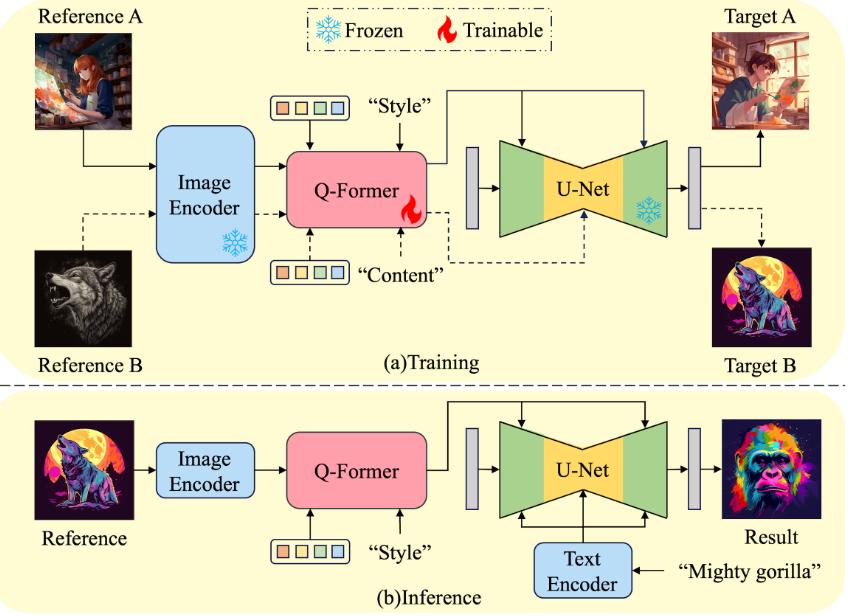
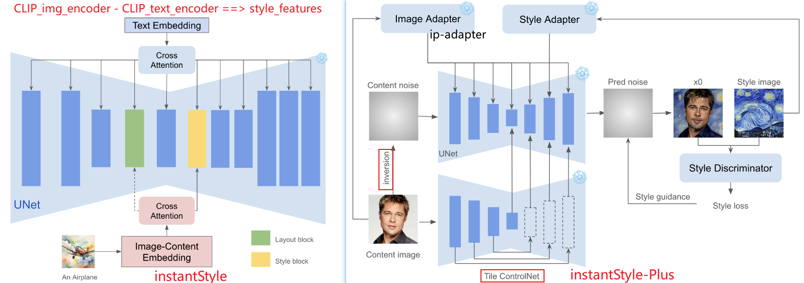
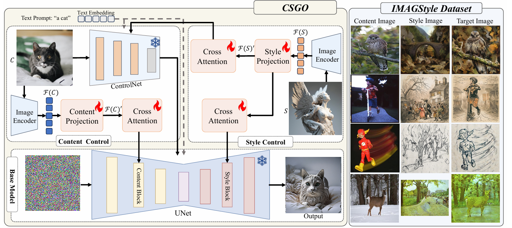
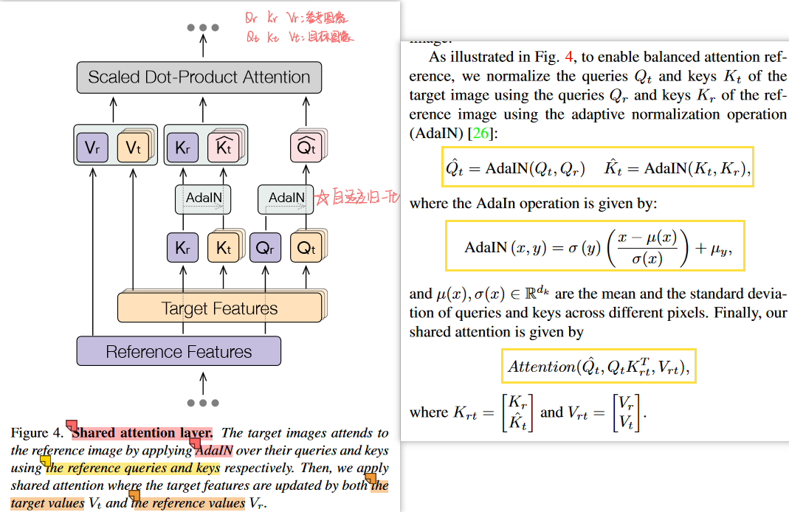
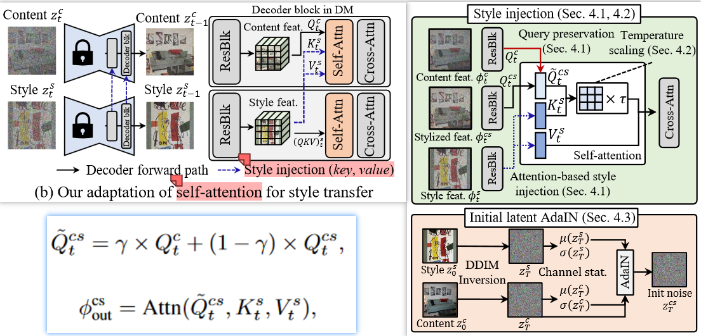
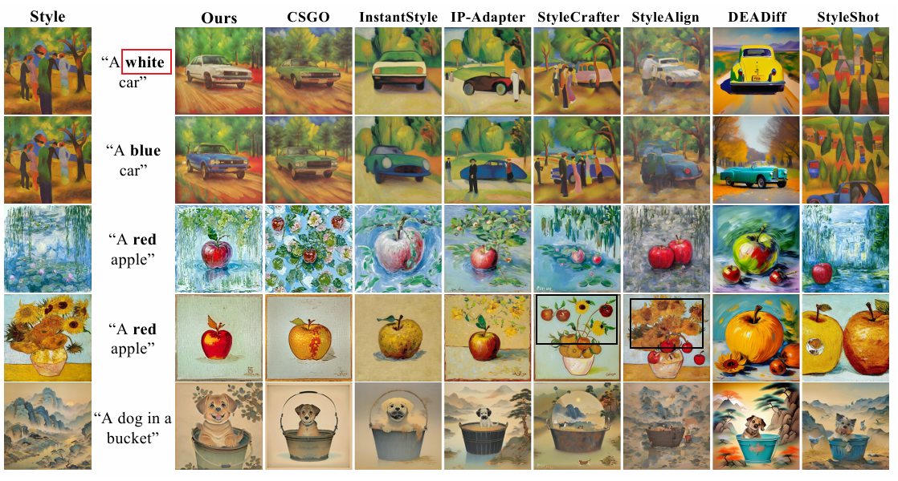

# Stylized generation（Based-Diffusion）基于扩散模型的风格化生成

面试时被问到关于风格化生成的发展路线，一下子紧张只说出了2个工作，但其实Diffusion发展至今已经有很多这方面的工作了。现在来做个总结，梳理一下风格迁移/风格化生成的发展路线，加深一下理解。

> 本文前提：只考虑由图像描述的风格提示，即风格是由一张具由显著风格的图像来进行控制的，本文称之为”风格参考图（reference style image）” + 本文只考虑图片生成，视频风格化不考虑
>
> 由于风格参考图以图像形式，不仅包含了风格信息，也包含了内容信息，因此经常会带来“内容泄露"：会把图片内容误认为是风格的一部分；针对此需要考虑如何将风格参考图中的“风格”与“内容”解耦。


**刚好有篇style-transfer的纯论文梳理的工作**：[Awesome-Style-Transfer-with-Diffusion-Models论文总结](https://github.com/Westlake-AGI-Lab/Awesome-Style-Transfer-with-Diffusion-Models) ：包括了图像的风格迁移和视频的风格迁移，其中图像的风格迁移包括了文本驱动的和图像驱动的，细分又按照技术路线进行了分类。在此基础上，我根据自己的理解和行文逻辑进行了下文的梳理，会把论文的关键技术要素概括出来。


1. 按照生成内容的输入模态可以分为：
   - 文本驱动的
   - 图像驱动的（较少、较难）

2. 按照技术路线分类：
   - 基于编码器encoder的：对风格特征进行提取并通过交叉注意力注入
   - 基于反演Invertion的：较早起研究，效果一般，后文不介绍
   - 基于注意力attention操作的：shared-attention、swap-attention

3. 按照每个风格的需求数据量分类：
   - zero-shot
   - few-shot：风格LoRA TI  Dreamdooth——> 风格LoRA还是最稳定的，但是如何减少风格集合带来的内容泄露也是一个可以优化的点


正文：

## 基于编码器encoder：

1. **IP-Adapter-2023.8:**

   - 分类：文本驱动的+图像驱动的、基于编码器encoder的、zero-shot
   - 总结：交叉注意力的方式注入风格参考图片中的特征，但特征中的风格与内容无法进行解耦——内容泄露+无法稳定的风格化生成；且对每一张参考图片需要手动调节scale

2. **DEADiff: An Efficient Stylization Diffusion Model with Disentangled Representations- CVPR 2024**

   - 分类：文本驱动的、基于编码器encoder的、zero-shot
   - 总结：通过对Q-former的训练，实现用Q-former对风格参考图片的内容与风格特征解耦 + 交叉注意力方式注入风格特征；
   - 缺点：**风格是无穷多样的，经过有限的风格对训练数据训练的Q-former没办法真正的全面的学到风格特征提取；这也是一切用风格对pair训练数据进行风格解耦训练的方法的统一缺点**
   - 

3. **InstantStyle: Free Lunch towards Style-Preserving in Text-to-Image Generation-2024.4**

   - 分类：文本驱动的、基于编码器encoder的、zero-shot

   - 总结：简单 又巧妙...

     - **将风格参考图片的内容与风格解耦：CLIP-image-encoder对风格参考图片提取图片特征，CLIP-text-encoder对风格参考图片的内容描述提取内容特征，两个特征相减！【假设：认为在CLIP文本对齐的性质具由文图特征空间是同一个特征空间】**
     - 对Unet分层研究：发现了特定层对风格的反应显著，命名为：layout block和style block；风格参考图的风格特征只注入这两个block【注入方式为IP-Adapter】

   - **InstantStyle-Plus: Free Lunch towards Style-Preserving in Text-to-Image Generation-2024.6** 

     - 分类：**图像驱动的**
     - 用了各种辅助模块进行内容的保留，也就是内容参考图像==>图像驱动，包括ipadapter、tile_controlnet; 风格上额外引入风格鉴别器；

     

   - **CSGO:  CONTENT-STYLE COMPOSITION IN TEXT-TO IMAGE GENERATION**  和instant style同一个团队

     - 分类：**图像驱动的**，基于编码器encoder的
     - 总结：分别训练了针对内容的和针对风格的特征投影+交叉注意力；
     - 缺点：利用了有限的风格内容pair对训练集，而风格是无穷的，是一切用风格对pair训练数据进行风格解耦训练的方法的统一缺点
     - 


## 基于注意力attention操作的

1. **Style Aligned Image Generation via Shared Attention**  -CVPR 2024  

   - 分类：文本驱动的、基于注意力attention的、zero-shot——>*实际本文并不具有”风格参考图片“，但结合invertion可以将第一张生成的图片理解为风格参考图片*，除了原repo，[github上有人对controlnlet的invertion做出了实现](https://github.com/AstitvaSri/Control-Style-Aligned-Generation.git)

   - 总结：**共享自注意力的思路很巧妙！！！midjourney的ref功能也许与这里相同？**可以利用生成过程中的注意力，迁移/共享给后续的生成过程，以得到相似内容/风格——多头注意力

     - sharing attention layers across the generated images【self-attention】 

     - Adaptive Instance Normalization = AdaIN :自适应实例归一化：风格迁移中常用的技术，通过调整内容图像的均值和标准差来匹配风格参考图像的均值和标准差，使得内容图像适应风格参考图像的风格分布【在传统风格迁移任务中，认为图片的均值、标准差在某程度上代表了抽象意义上的“风格”】

     - 代码：

       ```
       def adain(feat: T) -> T:
           feat_mean, feat_std = calc_mean_std(feat)
           # 计算风格参考图的均值和方差
           feat_style_mean = expand_first(feat_mean) # 抽取batch中索引为0的图片并扩展维度
           feat_style_std = expand_first(feat_std)
           # 实例归一化
           feat = (feat - feat_mean) / feat_std
           feat = feat * feat_style_std + feat_style_mean
           return feat
           
       def shared_call(  self, attn: attention_processor.Attention,  
       				  hidden_states, encoder_hidden_states=None,  attention_mask=None,   **kwargs):
           if self.adain_queries:   # AdaIN 操作
               query = adain(query)
           if self.adain_keys:
               key = adain(key)
           if self.adain_values:
               value = adain(value)
           if self.share_attention:
           	# 与batch[0]==风格参考图片特征，进行拼接
               key = concat_first(key, -2, scale=self.shared_score_scale) # # [bs, heads, query_length * 2 , d_k]
               value = concat_first(value, -2)                            # # [bs, heads, query_length * 2 , d_k]
               # 计算注意力
               if self.shared_score_shift != 0:
                   hidden_states = self.shifted_scaled_dot_product_attention(attn, query, key, value,) # [bs, heads, query_length , d_k]
               else:
                   hidden_states = nnf.scaled_dot_product_attention(
                       query, key, value, attn_mask=attention_mask, dropout_p=0.0, is_causal=False
                   )
           else:
               hidden_states = nnf.scaled_dot_product_attention(
                   query, key, value, attn_mask=attention_mask, dropout_p=0.0, is_causal=False
               )
       ```

       

   - 

2. **Style Injection in Diffusion: A Training-free Approach for Adapting Large-scale Diffusion Models for Style Transfer**- CVPR 2023.12 Highlight
   - 分类：**图像驱动的**、基于注意力attention的、zero-shot、基于invertion的
   - 总结：利用了invertion反演，也是在self-attention层进行操作：把风格的hidden_feature替换K/V，把内容的hidden_feature与原始hidden_feature加权作为Q；


总结：

- 现阶段的很多工作还是文本驱动的；
- 图片驱动的对于内容、风格解耦与组合要求更复杂，目前实现要么效果不好、要么十分复杂；

- few-shot的风格LoRA算是较为稳定的实现方式，但存在训练集的内容泄露问题；




# 补充：FLUX.1 Redux迁移---Redux_pro重风格化restyling

flux.1模型以及[flux.1 tools模型介绍]([Introducing FLUX.1 Tools - Black Forest Labs](https://blackforestlabs.ai/flux-1-tools/?ref=blog.comfy.org))：

- **flux.1 Fill : Inpaint / outpaint ：图像擦除、插入、 编辑与扩充**
- **flux.1 Redux : An adapter that allows mixing and recreating input images and text prompts. 输入图像的Variation、restyling**
- flux.1 Depth
- flux.1 Canny

综合应用：Redux+fill

- FLUX.1 Redux 提取图A主体的风格特征。
- 将图A与图B拼接，作为 FLUX.1 Fill 的重绘底图。
- FLUX.1 Fill 在局部重绘时，将 FLUX.1 Redux 提供的图A特征条件与底图的图A特征对齐，最终生成结果高度还原图A的主体特征。


综合应用：PuLID-FLUX-v0.9：换脸、人脸一致性
